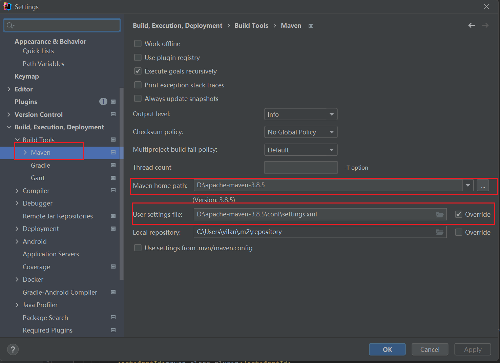
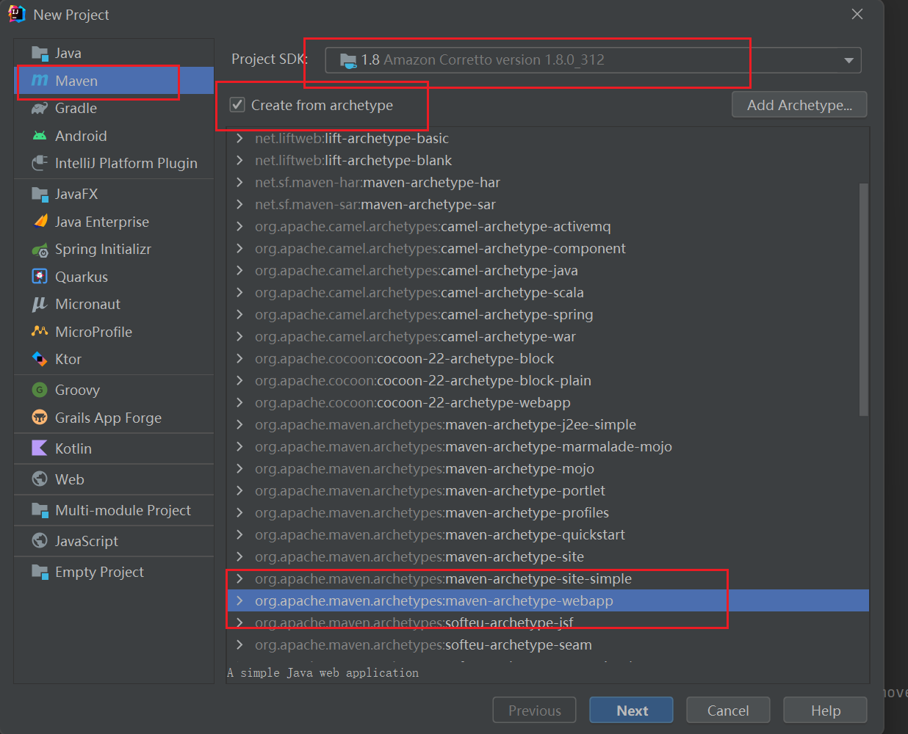
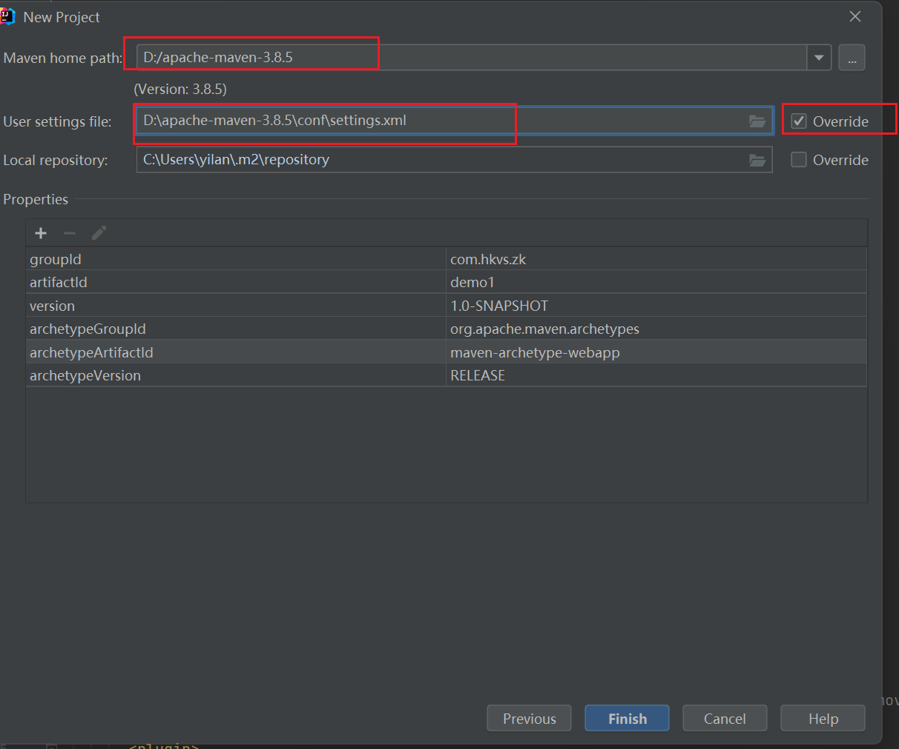

# maven

1、下载：https://maven.apache.org/

2、修改成阿里云的镜像仓库

​	maven/conf/setting.xml

````xml
    <mirror>
      <id>alimaven</id>
      <mirrorOf>central</mirrorOf>
      <name>aliyun maven</name>
      <url>https://maven.aliyun.com/repository/central</url>
    </mirror>
````

3、配置环境变量

| 变量       | 值                    |
| ---------- | --------------------- |
| MAVEN_HOME | D:\apache-maven-3.8.5 |

Path中加入：%MAVEN_HOME%\bin

检查：cmd中输入：mvn -version

4、maven的命令

详细命令在官网中的User Centre中


# IDEA中配置maven




# 创建maven项目





编译项目：可以在右上侧的maven中选择，也可在build中选择build project，还可以ctrl+f9

构建项目：https://start.spring.io/